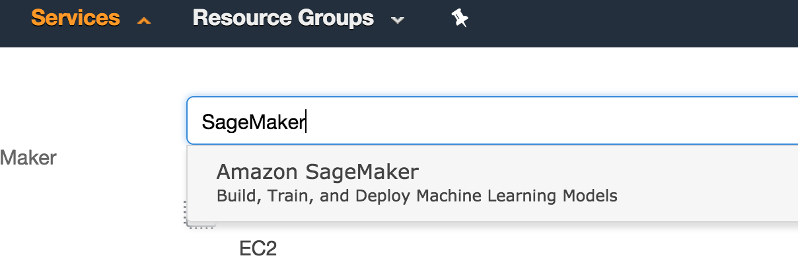
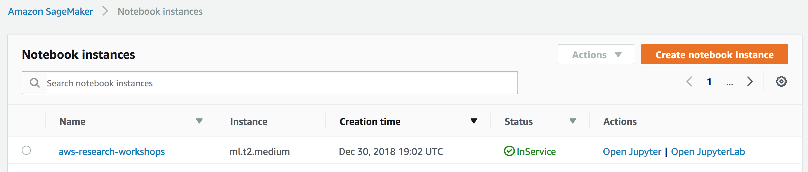
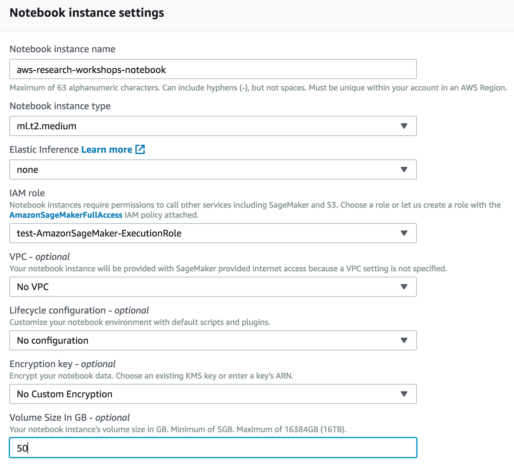
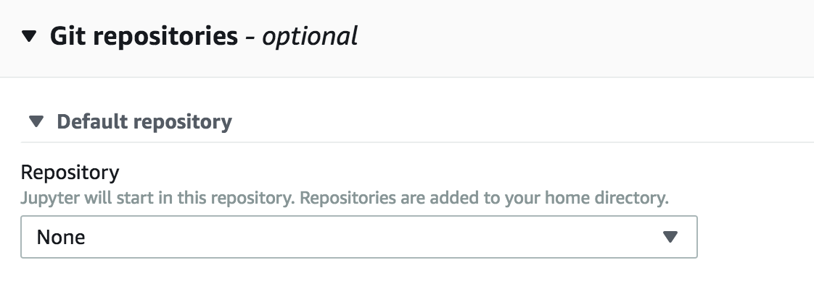
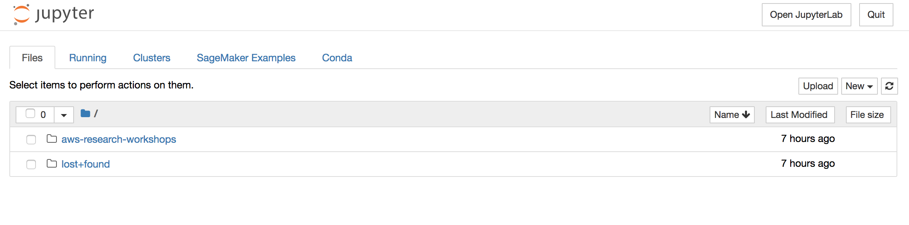

## AWS Research Workshops

This repo provides a managed SageMaker jupyter notebook with a number of notebooks for hands on workshops in data lakes, AI/ML, Batch, IoT, and Genomics. 

## Quickstart

To get the AWS Research Workshop Notebook up and running in your own AWS account, follow these steps (if you do not have an AWS account, please see [How do I create and activate a new Amazon Web Services account?](https://aws.amazon.com/premiumsupport/knowledge-center/create-and-activate-aws-account/)):

1. Save the research-env.yml to local file system
2. Log into the [AWS console](https://console.aws.amazon.com/) if you are not already
3. Choose **Launch Stack**  to open the AWS CloudFormation console and create a new stack.  
[](https://console.aws.amazon.com/cloudformation/home?region=us-east-1#/stacks/new?stackName=ResearchWorkshopNotebook)
3. Continue through the CloudFormation wizard steps
    1. Name your stack, i.e. ResearchWorkshopNotebook
    2. Use research-env.yml as the template file
    3. After reviewing, check the blue box for creating IAM resources.
4. Choose **Create stack**.  This will take ~20 minutes to complete.
5. The output of the CloudFormation stack creation will provide a Notebook URL (in the *Outputs* section of your stack details 

## Workshops

> Please review and complete all prerequisites before attempting these workshops.

Title               | Description
:---: | :---
[Introduction to AWS Basics](./notebooks/intro_to_aws/)                           | Learn about core AWS services for compute, storage, database and networking. This workshop has a hands-on lab where you will be able to launch an auto-scaled Apache web server behind an ALB, S3 bucket hosting content of the home page, and how to define the approriate roles for each resource.
[Building Data Lakes](./notebooks/building_data_lakes/) | In this series of hands-on workshops, you will learn how to understand what data you have, how to drive insights, and how to make predictions using purpose-built AWS services. Learn about the common pitfalls of building data lakes, and discover how to successfully drive analytics and insights from your data. Also learn how services such as Amazon S3, AWS Glue, Amazon Athena, and Amazon AI/ML services work together to build a serverless data lake for various roles, including data scientists and business users.
[Tensorflow with Amazon SageMaker](./notebooks/ml_tensorflow/) | Amazon SageMaker is a fully- managed platform that enables developers and data scientists to quickly and easily build, train, and deploy machine learning models at any scale. Amazon SageMaker removes all the barriers that typically slow down developers who want to use machine learning. We will show you how to train and build a ML model on SageMaker then how to deploy the inference end points on tools like AWS Greengrass or Serverless applications.
[Cost-effective Research leveraging AWS Spot](./notebooks/spot/) | With Amazon Web Services (AWS), you can spin up EC2 compute capacity on demand with no upfront commitments. You can do this even more cost effectively by using Amazon EC2 Spot Instances to bid on spare Amazon EC2 computing capacity. This allows users to get 90% off on demand prices (often as little as 1c per core hour) and has helped them run very large scale workloads cost effectively. For example, at USC a computational chemist spun up 156,000 core in three days. Also, with the recent release of the Spot fleet API, a researcher or scientist can easily have access to some of the most cost effective compute capacity at a very large scale. Learn how to effectively use these tools for your research needs.
[AWS Batch on AWS](./notebooks/hpc/) | In this workshop you will setup an AWS Batch environment for processing FastQC files leveraging the 1000 Genome dataset. Get started with AWS Batch by creating a job definition, compute environment, and a job queue for AWS Batch with the python SDK.
[AWS ParallelCluster on AWS](./notebooks/parallelcluster/) | In this workshop you will setup an AWS ParallelCluster environment with Slurm REST API endpoint. You will be running Priceton's Athena++ MHD simulation on the cluster and visualize the result, all from the Jupyter Notebooks. 
[Introduction to Containers on AWS](./notebooks/container/) | In this workshop, we will introduce containers for researchers. You will learn the basics of containers and how to run your workload with containers on AWS. 


## Prerequisites

### AWS Account

In order to complete these workshops you'll need a valid, usable AWS Account with Admin permissions.  The code and instructions in these workshops assume only one student is using a given AWS account at a time. If you try sharing an account with another student, you'll run into naming conflicts for certain resources. 

Use a **personal account** or create a new AWS account to ensure you have the neccessary access. This should not be an AWS account from the company you work for.

If you are doing this workshop as part of an AWS sponsored event, you will receive credits to cover the costs.

### Browser

We recommend you use the latest version of Chrome or Firefox to complete this workshop.

### Text Editor

For any workshop module that requires use of the AWS Command Line Interface (see above), you also will need a **plain text** editor for writing scripts. Any editor that inserts Windows or other special characters potentially will cause scripts to fail.


### IAM Role for Notebook Instance

A new IAM Role will be required for the workshops. The Notebook Instance requires `sagemaker.amazonaws.com` and `glue.amazonaws.com` trust permissions and the `AdministratorAccess` policy to access the required services in the workshops. Follow the instruction below to create the role in Python or use the `research-env.yml` file in CloudFormation to launch the notebook. 

<details>
<summary><strong>Python script instructions for creating the IAM Role (expand for details)</strong></summary><p>

``` python
import logging
import os
import time
import argparse
import botocore.session
import botocore.exceptions

def create_role(iam, policy_name, assume_role_policy_document, inline_policy_name=None, policy_str=None):
    """Creates a new role if there is not already a role by that name"""
    if role_exists(iam, policy_name):
        logging.info('Role "%s" already exists. Assuming correct values.', policy_name)
        return get_role_arn(iam, policy_name)
    else:
        response = iam.create_role(RoleName=policy_name,
                                   AssumeRolePolicyDocument=assume_role_policy_document)
        
        if policy_str is not None:
            iam.put_role_policy(RoleName=policy_name,
                            PolicyName=inline_policy_name, PolicyDocument=policy_str)
        logging.info('response for creating role = "%s"', response)
        return response['Role']['Arn']

def role_exists(iam, role_name):
    """Checks if the role exists already"""
    try:
        iam.get_role(RoleName=role_name)
    except botocore.exceptions.ClientError:
        return False
    return True

def get_role_arn(iam, role_name):
    """Gets the ARN of role"""
    response = iam.get_role(RoleName=role_name)
    return response['Role']['Arn']

iam = boto3.client('iam')

role_doc = {
        "Version": "2012-10-17", 
        "Statement": [
            {"Sid": "", 
             "Effect": "Allow", 
             "Principal": {
                 "Service": [
                     "sagemaker.amazonaws.com",
                     "glue.amazonaws.com"
                 ]
             }, 
             "Action": "sts:AssumeRole"
        }]
    }

inline_policy = {
        "Version": "2012-10-17",
        "Statement": [
            {
                "Action": [
                    "*",
                    "*"
                ],
                "Resource": [
                    "*"
                ],
                "Effect": "Allow"
            }
        ]
    }

role_arn = workshop.create_role(iam, firehose_role_name, json.dumps(role_doc), firehose_policy_name, json.dumps(inline_policy))
print(role_arn)
```
</p></details>

## Launching Research Notebook Instance

SageMaker provides hosted Jupyter notebooks that require no setup, so you can begin processing your training data sets immediately. With a few clicks in the SageMaker console, you can create a fully managed notebook instance, pre-loaded with useful libraries for machine learning.

<details>
<summary><strong>Step-by-step instructions (expand for details)</strong></summary><p>

1. In the upper-right corner of the AWS Management Console, confirm you are in the desired AWS region. Select a Region with SageMaker support.

2. From the Services drop-down menu type `SageMaker` to filter the list of all services.  This will bring you to the Amazon CloudFormation console homepage.



3. On the left hand side click **Notebook instances**, and click the **Create notebook instance** button at the top of the browser window.



4. In **Notebook instance settings** type `aws-research-workshops-notebook` into the **Notebook instance name** text box, select `ml.t2.medium` for the **Notebook instance type**, and enter `50` for **Volume Size in GB** leaving the other as defaults.



5. For IAM role, choose **Create a new role**, (steps to come) will require `sagemaker.amazonaws.com` and `glue.amazonaws.com` trust permissions and `AdministratorAccess` policy for access required services.

6. In the Git Repositories section clone this repo to be included in the notebook instance.



7. Click **Create notebook instance**.

</p></details>

#### Accessing the Notebook Instance

1. Wait for the server status to change to **InService**. This will take several minutes but likely less.


2. Click **Open**. You will now see the Jupyter homepage for your notebook instance.



## License Summary

This sample code is made available under a modified MIT license. See the [LICENSE](LICENSE) file.
