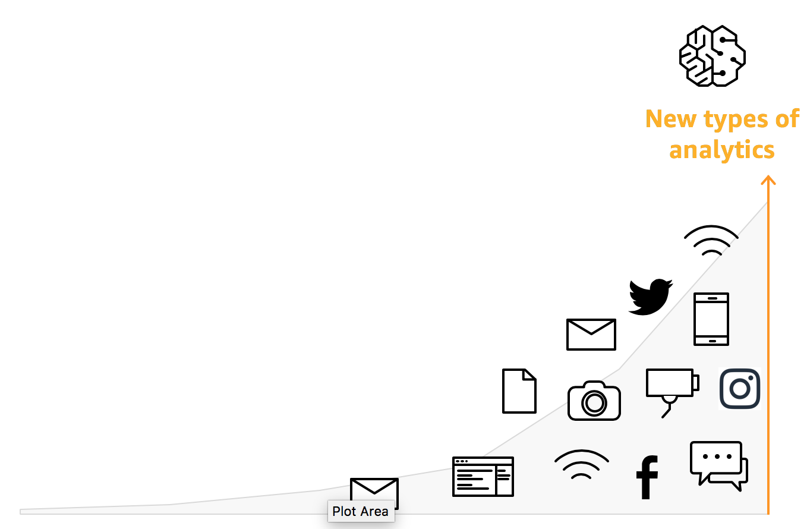
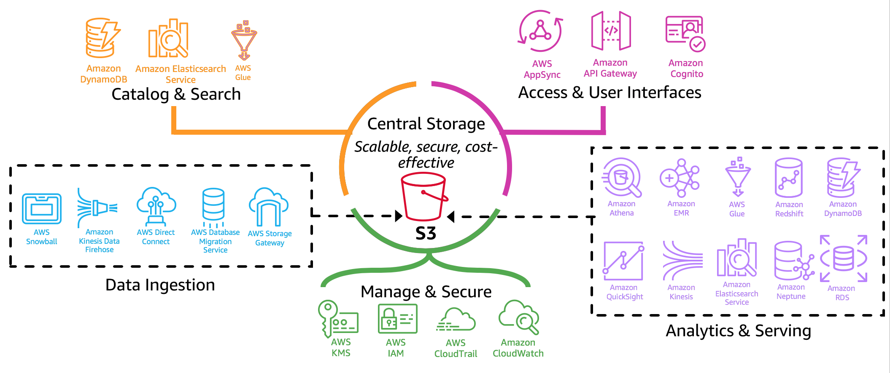
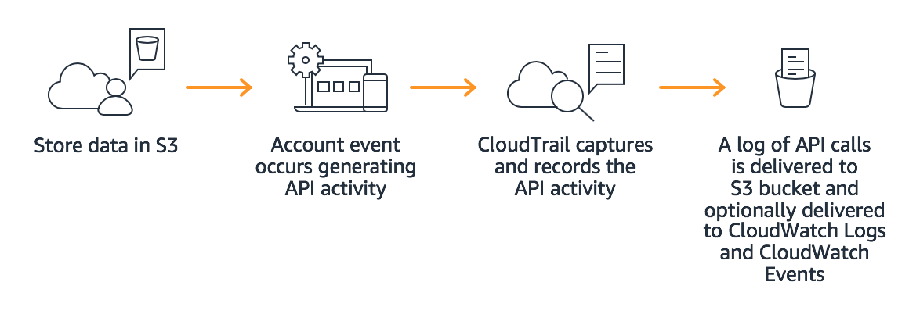
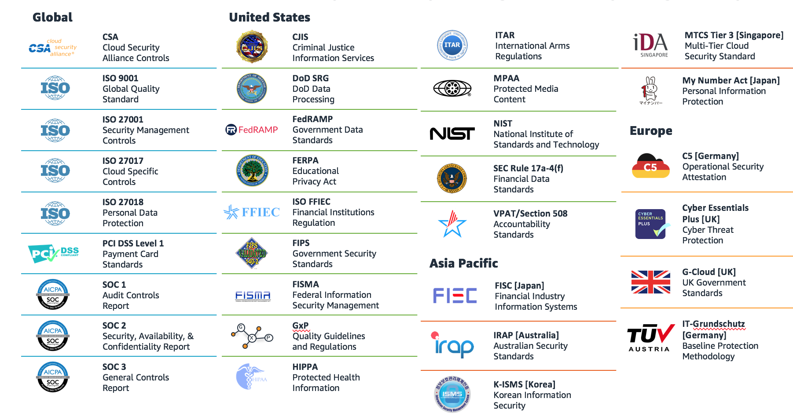
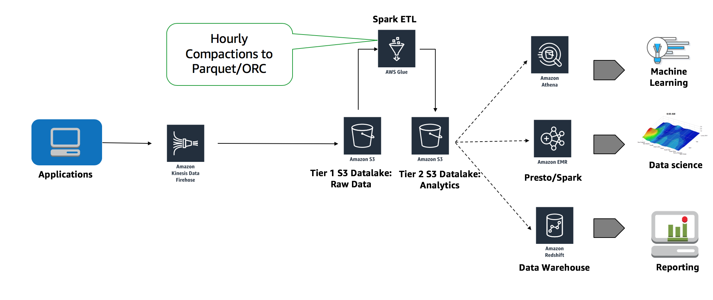
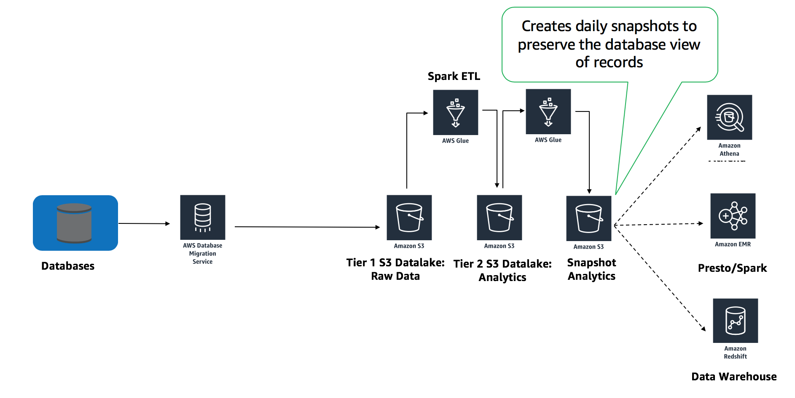
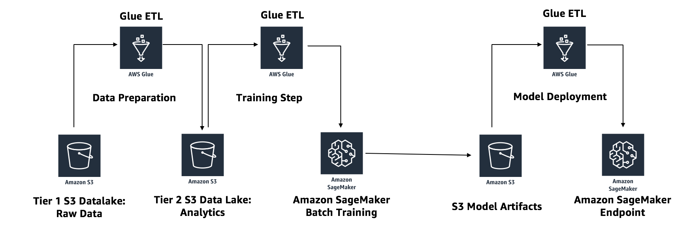

# Building a Data Lake for Analytics and Machine Learning

## What is a Data Lake on AWS?

A data lake provides a centralized repository that allows you to store your structured and unstructured data at any scale. A data lake can include both raw and curated datasets typically leveraged in analytics and AI/ML workloads. Raw datasets can be quickly ingested, in their original form, without having to force-fit them into a predefined schema. For a deeper discussion of Data Lake concepts refer to [`aws-dbs-refarch-datalake`](https://github.com/aws-samples/aws-dbs-refarch-datalake) in aws-samples on Github.

The core concepts of a data lake are:

* All data in one place, a single source of truth
* Handles structured/semi-structured/unstructured/raw data
* Supports for fast ingestion and consumption
* Schema on read
* Designed for low-cost storage
* Decouples storage and compute
* Supports protection and security rules

## Why Data Lakes?

* Volume
* Velocity
* Variety

## Data Lakes on AWS

The diagram below depicts the major categories of a Data Lake and the tools used in AWS to accomplish that section.

### Storage

[Amazon S3](https://docs.aws.amazon.com/AmazonS3/latest/dev/Welcome.html) is the typical underlying storage medium for data lakes on AWS. S3 provides a secure, highly scalable, durable object storage with millisecond latency for data access. Store any type of data–web sites, mobile apps, corporate applications, and IoT sensors.

***

**Durability, Availability & Scalability** - Built for eleven nine’s of durability; data distributed across 3 physical facilities in an AWS region; automatically replicated to any other AWS region.

**Security and Compliance** - Three different forms of encryption; encrypts data in transit when replicating across regions; log and monitor with CloudTrail, use ML to discover and protect sensitive data with Macie.

**Query in Place** - Run analytics & ML on data lake without data movement; S3 Select can retrieve subset of data, improving analytics performance by 400%.

**Flexible Management** - Classify, report, and visualize data usage trends; objects can be tagged to see storage consumption, cost, and security; build lifecycle policies to automate tiering, and retention.

**Cost Effective** - S3 has the ability to transition a variety of storage classes that fit you needs as well as the capabilty to lifecycle you storage to [Glacier](https://aws.amazon.com/glacier/) for achival storage needs.

### Data Ingestion

### Catalog & Search

### Security

#### Authentication

#### Authorization on data (and metadata)

[Fine-grained access to Glue Data Catalog](https://aws.amazon.com/blogs/big-data/restrict-access-to-your-aws-glue-data-catalog-with-resource-level-iam-permissions-and-resource-based-policies/)

#### Encryption of data at rest and in transit

#### Audit and monitoring

#### Centralized management

#### Compliance

### Analytics & AI/ML

## Best Practices

* Partitioning
* Compression
* File Size

## Common Patterns

There are a number of common patterns to leverage a data lake on AWS. This includes a number of batch and real-time streaming workloads as well as preparation for model building in [Amazon SageMaker](https://aws.amazon.com/sagemaker/). For more information on implementing these common patterns check out the 2018 re:Invent talk [Effective Data Lakes: Design Patterns and Challenges](https://www.youtube.com/watch?v=v5lkNHib7bw).

### Clickstream, Log Analytics, or IoT Data

### Database Replication

### Machine Learning - Batch Pipeline

# Workshop

In this workshop you will walk through using the [Yelp Reviews NLP Fast.ai](https://registry.opendata.aws/fast-ai-nlp/) form the AWS Open Data registry to catalog the raw data, gain sentiment insight from Comprehend, and visualizing the results.

* [Yelp Reviews Jupyter Notebook](https://github.com/aws-samples/aws-research-workshops/blob/master/notebooks/building_data_lakes/building_data_lakes-yelp.ipynb)