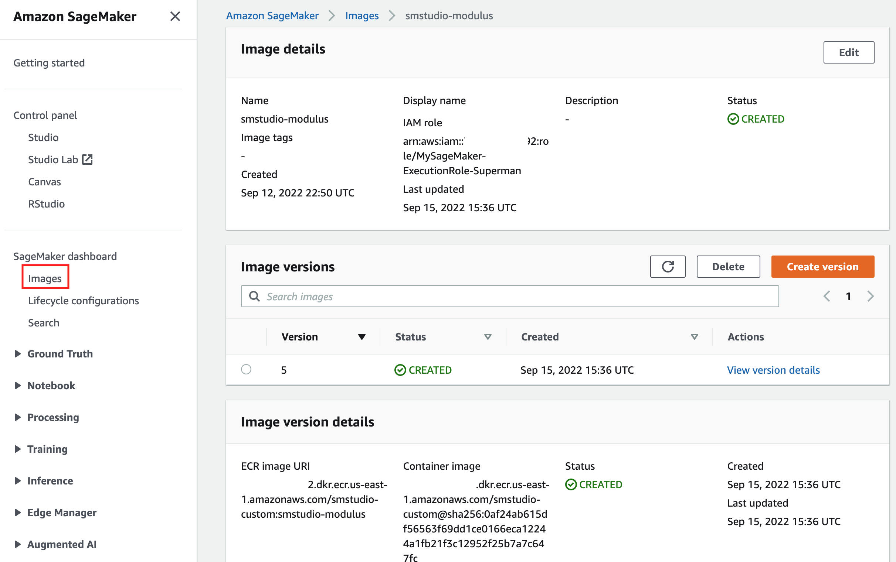
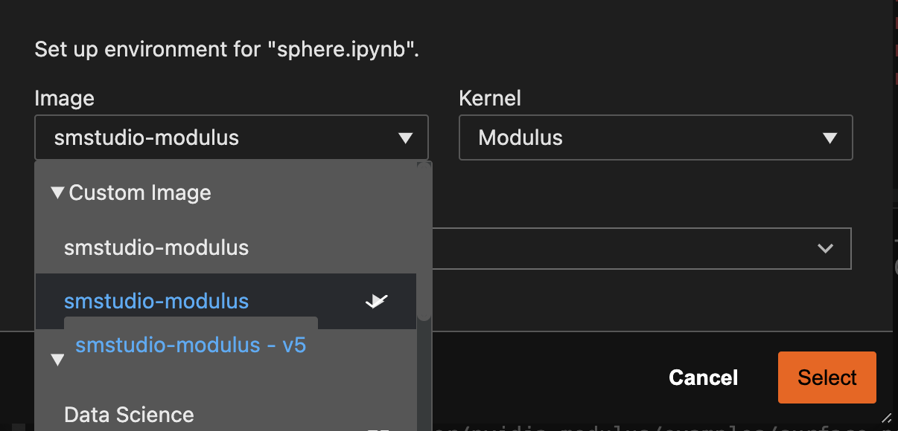

# Run NVIDIA Modulus In Amazon SageMaker Studio 

## Introduction
[NVIDIA Modulus](https://developer.nvidia.com/modulus) is a framework for developing Physics Informed Neural Network (PINN) models to solve physics problems governed by partial differential equations. The framework is optimized for GPU instances and use Python. 

Amazon Sagemaker is the go-to cloud Machine Learning service that separate the infrastructure (networking, IAM, storage, compute - both CPU and GPU) from Machine Learning frameworks (Tensorflow, Pytorch etc). The frontend is Jupter Notebooks via SageMaker Notebooks or SageMaker Studio. 

In this howto, we are going to show you how to run Modulus in SageMaker Studio. 

Please use this reference for more detailed information 

https://aws.amazon.com/blogs/machine-learning/bringing-your-own-custom-container-image-to-amazon-sagemaker-studio-notebooks/

## Step 1. Prepare your AWS account and your dev environment

1. Create a execution role with the IAM policy from https://aws.amazon.com/blogs/machine-learning/bringing-your-own-custom-container-image-to-amazon-sagemaker-studio-notebooks/.  Let's call the role *MySageMaker-ExecutionRole-Superman*

1. Create a SageMaker Studio domain. Your will need the *<domain-id>* later
Refer to https://docs.aws.amazon.com/sagemaker/latest/dg/studio-entity-status.html. 

1. Install SageMaker Studio Image Build tool
```
!pip install sagemaker-studio-image-build
```

## Step 2. Start with a Dockerfile

Start with the modulus base image, add some SageMaker tools and packages. 

```
FROM nvcr.io/nvidia/modulus/modulus:22.07

ARG NB_USER="sagemaker-user"
ARG NB_UID="1000"
ARG NB_GID="100"

RUN \
    useradd --create-home --shell /bin/bash --gid "${NB_GID}" --uid ${NB_UID} ${NB_USER} && \
    python -m pip install ipykernel && \
    python -m ipykernel install --sys-prefix --name=modulus


RUN pip install \
        'boto3>=1,<2' \
        'sagemaker>=2,<3' \
        'sagemaker-experiments>=0.1,<0.2' \
        'sagemaker-studio-image-build>=0.4,<0.5' \
        'smdebug>=0.9,<0.10'
# This image is using a version that's newer than what SageMaker is using. fix an imcompatibility issue 
RUN sed -i '70 i \                args_parser.add_argument("-f", "--fff", help="a dummy argument to fool ipython", default="1")' /modulus/modulus/hydra/utils.py

# Make the default shell bash (vs "sh") for a better Jupyter terminal UX
ENV SHELL=/bin/bash

# Install the AWS CLI:
RUN curl "https://awscli.amazonaws.com/awscli-exe-linux-x86_64.zip" -o "awscliv2.zip" && \
    unzip awscliv2.zip
#USER root
RUN ./aws/install

USER $NB_UID
```

## Step 3. Build Custom Image For SageMaker Studio

Run the following command (or build-image.sh script) in the folder that contains Dockerfile. Please replace *<account-id>* with your AWS account ID. This will build the docker image and register with AWS ECS repository. 


```
#!/bin/bash 
export IMAGE_TAG=smstudio-modulus

sm-docker build . -t smstudio-modulus -t <account-id>.dkr.ecr.us-east-1.amazonaws.com/smstudio-custom:smstudio-modulus --repository smstudio-custom:smstudio-modulus --role MySageMaker-ExecutionRole-Superman
```

## Step 4. Create the custom image in SageMaker. 

You can follow the steps in the blog using AWS Console to complete the image creation process or run the following command line (create-and-update-image.sh)

**You will need to replace the <account-id> and <domain-id> with real values**

```
IMAGE_NAME=smstudio-modulus #Replace with your Image name
REGION=us-east-1
ACCOUNT_ID=<account-id>
DOMAINID=<domain-id>

# Using with SageMaker Studio
## Create SageMaker Image with the image in ECR (modify image name as required)
ROLE_ARN='arn:aws:iam::<account-id>:role/MySageMaker-ExecutionRole-Superman'

aws --region ${REGION} sagemaker create-image \
    --image-name ${IMAGE_NAME} \
    --role-arn ${ROLE_ARN}

aws --region ${REGION} sagemaker create-image-version \
    --image-name ${IMAGE_NAME} \
    --base-image "${ACCOUNT_ID}.dkr.ecr.${REGION}.amazonaws.com/smstudio-custom:${IMAGE_NAME}"
    
## Create AppImageConfig for this image (modify AppImageConfigName and KernelSpecs in app-image-config-input.json as needed)
aws --region ${REGION} sagemaker create-app-image-config --cli-input-json file://app-image-config-input.json

## Update the Domain, providing the Image and AppImageConfig
aws --region ${REGION} sagemaker update-domain --domain-id ${DOMAINID} --cli-input-json file://default-user-settings.json
```

## Step 5. Update the image version in SageMaker/Images
Once you build the docker, you might need to update the image in SageMaker. You can do that in the SageMaker console as the following



## Step 6. Use Modulus kernel in SageMaker

Once the modulus image is registered with SageMaker, the Module kernel will be available in Jupyter Notebooks



## Step 7. Enjoy Modulus examples in SageMaker Studio 
You can simply create a blank Jupyter Notebook and paste any Modulus examples into that notebook to run the python code.  

You might need to change the config_path from "conf" to "/.conf"
```
@modulus.main(config_path="./conf", config_name="config")
```
